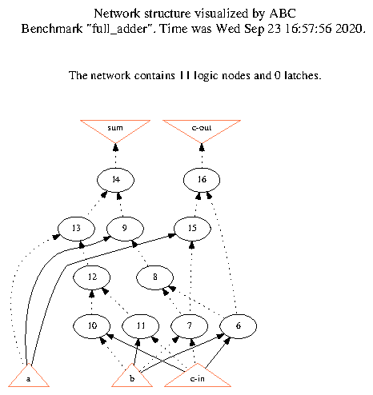

## Programming Assignment 2

### Submission Guidelines

Please send a pull request to the branch named with your student ID during the submission period (see below).

Before opening a pull request, please synchronize your local branch with the destination branch (namely, the branch with your student ID) to avoid merge conflicts.

Please develop your code under `./src/ext-lsv`.

#### Submission Periods

- 2020/12/10 11:00-13:00

### 1. [Testing Unateness of Primary Outputs]

(100%)

Write a procedure in ABC to print the unate information for each primary output in terms of all primary inputs,
whose function is encoded as an and-inverter graph (AIG).
Integrate this procedure into ABC, so that running command `lsv_print_pounate` will invoke your code.
You can assume the input network given to your command is already converted into an AIG.

We say that a primary output _f_ is _positive unate_ in terms of a primary input _x_ if its function _F_ (encoded by the AIG) satisfies _F(...,x=0,...) &rarr; F(...,x=1,...)_.
Similarly, _f_ is _negative unate_ in terms of _x_ if _F_ satisfies _F(...,x=1,...) &rarr; F(...,x=0,...)_.
Moreover, _f_ is called _binate_ in terms of _x_ if _f_ is neither positive nor negative unate in terms of _x_.

As an example, for the following AIG,


your program prints:

```
node sum:
binate inputs: a,b,c-in
node c-out:
+unate inputs: a,b,c-in
```

To ease the grading process of your code,
please print the primary outputs in the order of `Abc_NtkForEachPo()`.
Please print the names of primary inputs returned by function `Abc_ObjName()` in a single line, separate their names with commas, and sort them in an increasing order with respect to their object IDs returned by function `Abc_ObjId()`.

If there is a primary output without any primary input in its transitive fanin cone, please do not print this primary output.
If there is no satisfying primary input for a certain unateness,
please do not print an empty line.
That is, for example, if there is no binate primary input of a primary output, do not print such line

```
binate inputs:
```
